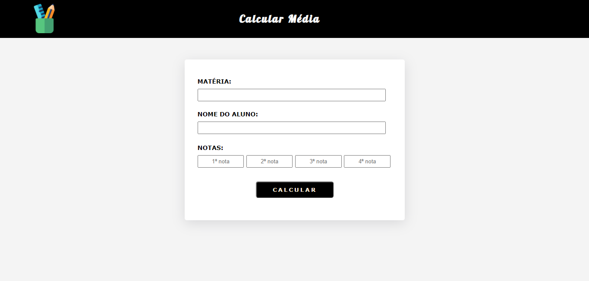
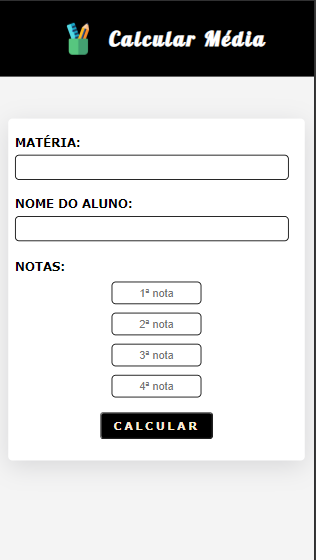

<h1 align="center">
   🖩 | Calculadora de Média
</h1>

<h4 align="center">
  Site simples para calculo de média, feito para treinar javaScript
</h4>

---

<h3>VERSÃO WEB</h3>

<h3>VERSÃO MOBILE</h3>

<table align="center">
  <tr>
    <td align="center">
      <a href="https://github.com/laisfrr">
         
      </a>
    </td>
  </tr>
</table>

---

## ✅ O site é composto por :

-   **Home:** Onde possui os campos para preenchimento de nome da matéria, nome do aluno e as notas.

---

## ⚙ Tecnologias utilizadas

-   HTML;
-   CSS;
-   Javascript;

---

## ⚠ Dificuldades durante o projeto

-   Funções com javascript
-   Utilizar o DOM

---

## 👩 Autor(a) 

<table align="center">
  <tr>
    <td align="center">
      <a href="https://github.com/laisfrr" target="_blank">
         
        
          <b>Laís Oliveira</b>
        
      </a>
    </td>
  </tr>
</table>

<table align="center">
    <td align="center">
      <a href="https://www.linkedin.com/in/laisfrr/" target="_blank">
         
      </a>
</table>
